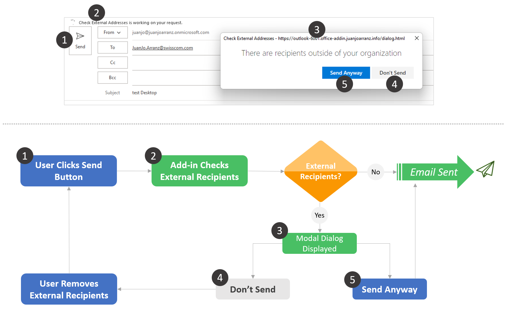
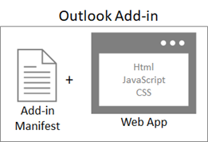
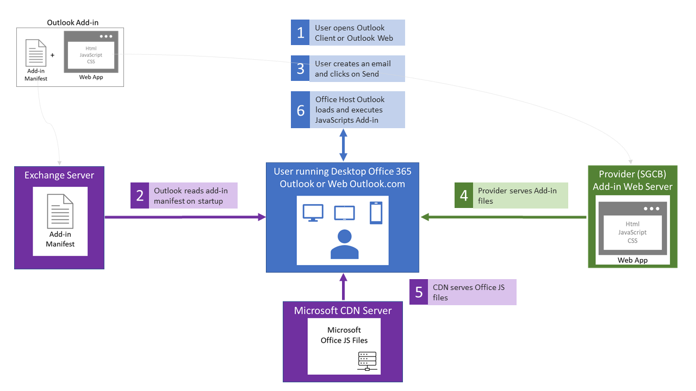

# On-send-Check-External-Addresses Outlook Add-in
This Outlook Add-in objecitve is to notify users before sending emails to recipients outside of the organization.

When the user clicks on the "Send" button, a modal dialog is displayed if there is any external recipient. The user may choose the send it anyway or remove the external addresses before the sending.

 

# Technical Design
The Outlook Add-in includes two basic components: an XML manifest file and a Web Application.

 

The manifest defines various settings, including how the add-in integrates with Office clients, the URL location of the Web Application and the required permissions.
The Web Application consists of static Html files displayed inside an Office application as Outlook. To interact with the Outlook client the Web Application uses the Office.js JavaScript APIs.

The Office JavaScript APIs contain objects and members for building add-ins and interacting with Office content and web services. There is a common object model that is shared by Excel, Outlook, Word, PowerPoint, OneNote and Project. These APIs provide access to well-known objects such as email messages, paragraphs and workbooks, which makes it easier to create an add-in for a specific application.
The current Outlook Add-in works with email messages and specifically with the “ItemSend” Event of email messages.

As illustrated below, the Add-in manifest must be deployed and installed on an Exchange Server such as Exchange Online.

The Web Application must be deployed to a Web Server owned and managed by the Add-in provider. The web server can be located on premises or in the cloud and must have connectivity to the public Internet.

The below diagram depicts the different components and how they relate one another.

